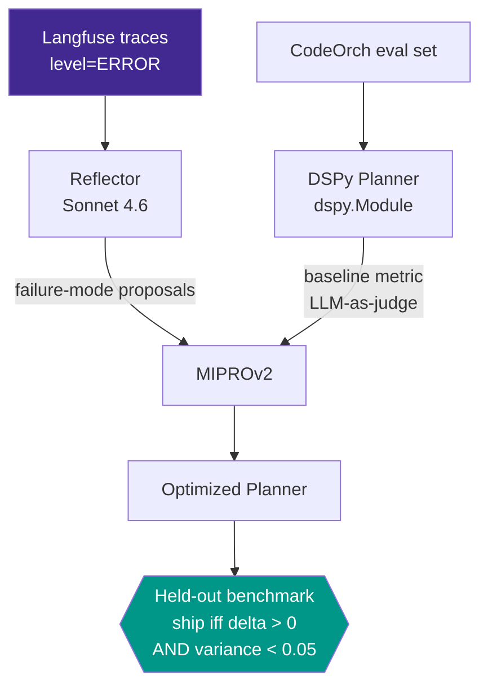

<div align="center">

<!-- ponytail: hero banner is a placeholder — drop a real 1280×320 PNG at docs/banner.png to replace this line -->


# 🧬 EvoAgent

### DSPy self-improvement layer for [CodeOrch](https://github.com/iamr1ddl3/codeorch)

*A multi-agent system that doesn't learn from its own production failures is a static system with telemetry. EvoAgent closes the loop.*

<br/>

[](LICENSE)
[](https://www.python.org/)
[](https://github.com/stanfordnlp/dspy)
[](https://www.anthropic.com/)
[](https://langfuse.com/)

<br/>

[**Pipeline**](#-pipeline) · [**Result**](#-result-on-the-planner) · [**Quick Start**](#-quick-start) · [**Roadmap**](#-roadmap) · [**Known Limits**](#-scope--known-limits)

</div>

---

## 🧭 Overview

Reads Langfuse failure traces produced by CodeOrch's multi-agent pipeline, classifies failure modes, optimizes agent prompts via DSPy / MIPROv2, and produces before/after benchmark evidence with a **strict ship-or-don't-ship decision criterion.**

Observed failures become structured proposals → those proposals seed DSPy demos → MIPRO compiles a candidate prompt → a held-out benchmark decides whether the candidate ships.

---

## 🧩 Pipeline



---

## 📊 Result on the Planner

After running the full loop on CodeOrch's Planner agent against a 10-spec golden eval (6 train, 4 held-out):

| Stage | Score |
|---|---|
| Sonnet baseline (LLM-as-judge metric) | 0.833 |
| Haiku baseline (the demotion target) | 0.867 |
| MIPRO train-set score | 0.875 → 0.903 (**+2.78pp**) |
| MIPRO held-out delta | **−0.042** |

> [!IMPORTANT]
> **Decision: the optimized prompt did NOT ship to production** — and that negative result is the strongest finding. The held-out result revealed task-class overfit: `rate_limiter` improved by +0.17 (the hard spec MIPRO generalized to), but `chunk` and `groupBy` each regressed by 0.17. The optimized prompt produces a more verbose decomposition pattern: right for hard specs, wrong for simple ones.

It argues for **multi-prompt routing over monolithic optimization** — the same architectural argument as CodeOrch's RouterBench (route gate variants by task complexity), applied at the prompt layer: route between a hand-written prompt for simple specs and an MIPRO-compiled prompt for hard ones.

The full report ([`reports/before_after.html`](reports/before_after.html)) includes per-spec error bars, an honest disclosure of DSPy cache effects on variance estimates, and the rate-limit-affected MIPRO trials.

---

## 🚀 Quick Start

```bash
# 1. Set env
cp .env.example .env  # fill ANTHROPIC_API_KEY + both LANGFUSE_* key sets

# 2. Install
python -m venv .venv && source .venv/bin/activate
pip install -r requirements.txt

# 3. Run Reflector against the last 7 days of CodeOrch errors
python scripts/run_reflector.py --since 7d

# 4. Baseline (Haiku with LLM-as-judge metric)
python scripts/baseline_planner.py --model haiku --metric judge

# 5. MIPRO compile + held-out benchmark
python scripts/optimize_planner.py
python scripts/benchmark_compare.py

# Open reports/before_after.html for the full result
```

---

## 📦 What's in this repo

| Path | What |
|------|------|
| `agents/reflector.py` | Pulls error observations from Langfuse, groups by `(agent_name, error_class)`, emits structured edit proposals |
| `dspy_modules/planner.py` | DSPy `Signature(spec → plan)` + `dspy.Module` wrapping CodeOrch's Planner |
| `dspy_modules/judge.py` | LLM-as-judge composite metric (coverage / atomicity / testability) with anti-bias structure |
| `scripts/run_reflector.py` | CLI: fetches recent error traces, prints classified failure-mode report |
| `scripts/baseline_planner.py` | Measures Planner baseline; supports `--model {sonnet\|haiku}` and `--metric {validity\|judge}` |
| `scripts/optimize_planner.py` | MIPROv2 compile loop with explicit budget guards and committed train/val split |
| `scripts/benchmark_compare.py` | Held-out benchmark + plotly HTML report |
| `tests/` | Smoke + unit tests |
| `reports/` | Evidence artifacts: reflector output, baseline scores, MIPRO run metadata, before/after HTML |

---

<details>
<summary><b>🧱 Stack + why two Langfuse projects</b></summary>

**Stack**
- **Anthropic Claude** — same model IDs as CodeOrch (Sonnet 4.6 for the Planner target)
- **Langfuse v4 SDK** — `LangfuseAPI` for trace queries (read-side); separate Langfuse project from CodeOrch to keep optimizer telemetry isolated from production telemetry
- **DSPy 2.5+** — `Signature`, `Module`, MIPROv2 optimizer
- **CodeOrch infra** — reuses CodeOrch's `evals/promptfoo.yaml` directly (single source of truth — MIPRO trains on the same distribution the held-out benchmark scores against)

**Why two Langfuse projects**

EvoAgent reads CodeOrch's traces and writes its own. Sharing one project would conflate dashboards — Reflector's classification calls would inflate CodeOrch's cost/latency averages, and MIPRO's hundreds of trial spans would drown CodeOrch's actual production runs.

The fix: **codeorch project** (production traces) and **evoagent project** (the optimizer itself). `.env` carries two key-pairs:

```
LANGFUSE_PUBLIC_KEY            # writes here (evoagent's own project)
LANGFUSE_SECRET_KEY
CODEORCH_LANGFUSE_PUBLIC_KEY   # reads from here (codeorch's project)
CODEORCH_LANGFUSE_SECRET_KEY
```

</details>

---

## 🗺️ Roadmap

- Multi-prompt routing layer — route between hand-written and MIPRO-compiled prompts based on a task-complexity classifier
- Property-based eval suite (Hypothesis) so the held-out benchmark covers invariants, not just example specs
- Reflector exemplar-anchored failure-class labels for deterministic cross-run classification
- Code-level self-improvement (extension of the Reflector pattern from prompt edits to source patches, with sandbox verification)

---

## 🔍 Scope / Known Limits

**In scope.** A self-improvement layer that reads production failure traces (Langfuse), classifies failure modes via a Reflector agent, runs DSPy/MIPROv2 to compile candidate prompts, and enforces a held-out decision criterion. End-to-end working demo with a documented negative result on the Planner module.

**Known limits.**

- Held-out benchmark is small (5 specs). Directionally informative but high variance; expand to 30+ before treating individual deltas as definitive.
- MIPRO compile is rate-limit-affected on Anthropic free tier; some trials degrade in quality through no fault of the optimizer. Production runs need paid-tier quota.
- The Reflector currently classifies error observations from a single source project — generalizing across multiple source projects needs domain-specific failure taxonomies.
- Single-prompt MIPRO optimization is sensitive to task-class overfit (the Day 9 finding). Multi-prompt routing per task class (roadmap item) is likely the correct shape.

---

## 📚 Further Reading

- `reports/` — actual MIPRO compile evidence, scorecards, before/after deltas tracked per run.
- Companion repo: [CodeOrch](https://github.com/iamr1ddl3/codeorch) — the production system EvoAgent reads from and improves.

## License

MIT
